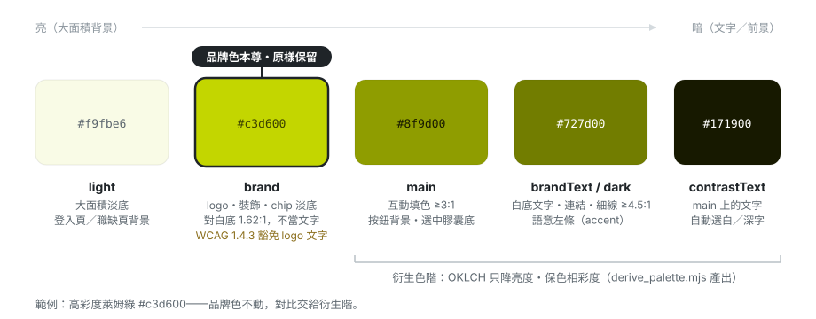
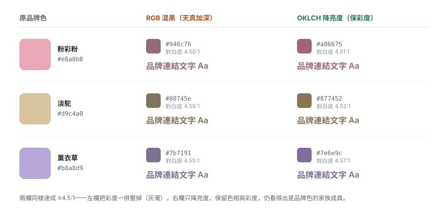

## 概述

客戶給的品牌色經常過不了 WCAG 對比（亮萊姆對白底只有 1.62:1），但**為了配色去改客戶的主視覺不是好做法**。這篇是品牌色配色器（company-color-palette skill）的使用指南：核心原則是「品牌色原樣保留、限定角色，對比交給衍生色階」——以品牌色為輸入，在 OKLCH 感知空間衍生出一整套對比安全的角色色（按鈕填色、白底文字、淡底背景等），定稿 hex 直接寫進專案 config。

通用原則可跨專案使用；文中實例取自一個高彩度萊姆綠品牌色（`#c3d600`）。急著用：看下方「快速上手（Take-away）」；想懂為什麼這樣設計：讀「核心原則：不改品牌色」與「研究依據：業界怎麼做」。

## 快速上手（Take-away）

目標是「拿到一份能給客戶看的 HTML」，三條路徑由快到細：

### 路徑 1：一句話交給 Claude（最快、客戶級產出）

```
用 company-color-palette 幫〈公司名〉想配色，產 HTML 預覽
```

附上 logo 圖檔或既有品牌色 hex。skill 會自動：取色 → 依產業推三組方案（含狀態色）→ `render_palette.py` 產出自包含 HTML（完整色票＋求職者卡片情境預覽）。**這份 HTML 就是給客戶參考用的**，直接傳。

### 路徑 2：已有品牌色，30 秒看角色色（內部參考）

```bash
cd ~/.claude/skills/company-color-palette
node scripts/derive_palette.mjs '#品牌色hex'        # 終端看角色色＋對比值
open references/derive-palette-tester.html          # 瀏覽器輸入 hex 看 UI 渲染
```

注意：tester 頁含新舊演算法比較，是**內部工具**；要給客戶看請走路徑 1 或 3。

### 路徑 3：手動組客戶級 HTML（品牌色已定、不想跑完整 skill）

```bash
node scripts/derive_palette.mjs '#品牌色hex' --json   # 取得角色色
# 將輸出填進 palette.json（schema 見 render_palette.py 開頭註解；
# primary=main、primaryLight=light、primaryDark=dark；狀態色需自行補上——
# 依「配色推導原則」靠攏品牌溫度，勿用框架預設藍綠紅）
python3 scripts/render_palette.py palette.json preview.html
```

產出與路徑 1 相同等級的客戶預覽頁。狀態色不確定怎麼補時，回到路徑 1 讓 skill 推。

## 核心原則：不改品牌色

品牌色是客戶的識別資產——擅自加深或改寫等於動了客戶的主視覺，傷識別度、也可能牴觸客戶自己的品牌規範。**對比不足是我們的工程問題，不是客戶品牌的問題**，所以解法永遠在我們這側：

1. **品牌色原樣保留，限定角色**：原色只指派給它能勝任的位置——logo、裝飾、大面積識別場景、chip 淡底（配深字）。WCAG SC 1.4.3 對 logo/品牌名文字有條件豁免對比要求（條件見研究依據節）。
2. **需要過對比的角色用衍生深階**：按鈕填色（≥3:1）、白底上的品牌文字/連結/細線（≥4.5:1）使用品牌色的深階衍生色。
3. **衍生在感知空間做**：OKLCH 只降亮度、保色相與彩度；不用 RGB 混黑或 HSL 降 lightness，中彩度品牌色會被壓得灰濁。

以某客戶萊姆綠為例，一條色階上各角色的位置：



敘事紀律：衍生色是「品牌色的家族成員」，不是品牌色的「修正版」。對客戶提案與內部文件一律使用「衍生」「角色限定」的說法，不用「校正」——用詞決定了客戶聽到的是「我們為你的品牌打造了一套安全色階」還是「我們改了你的顏色」。

## 研究依據：業界怎麼做

2026-06 對主流設計系統與無障礙工具的調查結論：**沒有任何系統靠「修改品牌色本身」解決對比問題**。共識做法收斂為四種策略，且可並用：

1. **衍生色階（tonal ramp）**：保留品牌色相，在感知均勻色彩空間往深淺展開，深階給文字、原色留識別場景
2. **角色限定（semantic roles）**：品牌色只指派給它能勝任的角色，對比檢查依「角色配對」而非逐處檢查
3. **前景色反推（on-background）**：背景用品牌色不動，依背景亮度自動選可讀的前景文字色
4. **對比作為生成輸入（contrast-first）**：目標對比是色階生成的輸入參數，不是選色後的稽核項目

### 各系統的實作

四個系統的產品性質不同，面對的對比問題與判斷角度也不同，參考時要對照自己的情境：**Stripe** 是金流平台，這裡引用的是它為自家儀表板/文件打造內部設計系統的工程經驗——單一品牌、大量資料密集 UI；**Radix Colors** 是開源 UI 元件庫的配色系統，要服務「任意使用者帶任意品牌色進來」的通用場景；**Adobe Leonardo** 是 Adobe 開源的色階生成工具（網頁工具＋ JS API），本身就是設計期工具、不綁定任何 UI 框架；**Reshaped** 是商用 React 設計系統，主打「換一個主題色、整套元件自動保持可用」的 theming 體驗。Stripe、Radix、Leonardo 偏「設計期定稿」；Reshaped 則把規則做進系統、執行期自動套用。

**Stripe** — 審查發現除黑色外所有小字文字色都不過 4.5:1。明確否定「天真加深」（naive darkening）：直接把品牌色壓暗雖過標，但結果「dark and muddy」、失去品牌活力。解法是在 CIELAB 感知均勻空間操作，保留色相與飽和度的感知特徵、只調亮度。生成的色階帶結構性配對規則：**任兩色索引差 ≥5 保證過小字對比（例如第 3 階配第 8 階；大字/圖示 ≥4）**，配對靠數階差、不必逐對測試。

兩種加深方式的實際差異（中彩度品牌色最明顯；Stripe 用 CIELAB、本工具用 OKLCH，同屬感知均勻空間，下圖以 OKLCH 示意）：



**Radix Colors** — 12 階色階各有固定職責：1-2 背景、3-5 元件底、6-8 邊框、**9 = 品牌色本尊**（chroma 最高的「最純」一階，只用於 solid 填色）、10 hover、**11-12 才是文字色**。品牌色明確不擔任文字角色。對比目標採 APCA（較新的感知對比演算法，與 WCAG 2.x 的比值制不同）。

**Adobe Leonardo** — `generateContrastColors()` 以品牌 key color ＋目標對比度為輸入，內插出每一階剛好命中指定對比的色。官方定位：「以對比為起點，而非選色後的稽核流程」。

**Reshaped** — 每個背景 token 自動產生對應的 on-background token，依背景亮度翻轉黑/白字（黃色主色 → 自動配黑字）。品牌背景完全不動。已知缺陷：**中亮度色死區**——某些中間亮度的色，純黑與純白都到不了 4.5:1，黑白翻轉法無法保證 AA。

### WCAG 對品牌元素的豁免

- **SC 1.4.3 規範正文**明列：「Logotypes: 屬於 logo 或品牌名稱的文字，無對比要求」。措辭在 WCAG 2.0/2.1/2.2 一致。
- **豁免是有條件的**：只適用於「低對比是品牌規範所強制」的情況；若是開發者自己的選擇，不豁免。W3C 並建議品牌規範允許時選用對比較高的 logo 變體。

### 注意事項（易誤信的點）

- **互動式 logo 不自動豁免**：SC 1.4.11（非文字對比）的規範正文沒有 logo 例外；logo 兼作按鈕/連結等 UI 元件時仍須過 3:1。
- **「Radix 產生器保證過對比」是錯的**：APCA 是 Radix 的設計目標，對任意品牌色輸入不提供絕對保證（驗證時被駁倒）。
- **「豁免取決於圖形或文字格式」是錯的**：豁免條件是「是否為品牌規範強制」，與 logo 是圖檔或純文字無關（驗證時被駁倒）。
- **APCA ≠ WCAG 2.x**：兩種對比模型不可直接互換；客戶合約要求 WCAG AA 時，APCA 達標不等於合規。

來源：[Stripe — Designing accessible color systems](https://stripe.com/blog/accessible-color-systems)、[Radix Colors — Understanding the scale](https://www.radix-ui.com/colors/docs/palette-composition/understanding-the-scale)、[Adobe Leonardo](https://github.com/adobe/leonardo)、[Reshaped — Color tokens](https://www.reshaped.so/docs/tokens/color)、[W3C Understanding SC 1.4.3](https://www.w3.org/WAI/WCAG21/Understanding/contrast-minimum.html)、[W3C Understanding SC 1.4.11](https://www.w3.org/WAI/WCAG21/Understanding/non-text-contrast.html)

## 使用方式

兩種進入點，依手上有什麼選擇：

- **新客戶、還沒定品牌色** → 走完整 company-color-palette skill 流程：從 logo 取色、依產業調性產出三組方案、HTML 預覽。觸發方式：請 Claude「幫某某公司想配色」。
- **品牌色已定案、只要角色色** → 直接跑 `derive_palette.mjs`。

### CLI

```bash
cd ~/.claude/skills/company-color-palette
node scripts/derive_palette.mjs '#c3d600'
node scripts/derive_palette.mjs '#c3d600' --json            # 給程式吃
node scripts/derive_palette.mjs '#e8a8b8' --floor 3 --text-floor 4.5 --surface '#ffffff'
```

| 參數 | 預設 | 說明 |
|------|------|------|
| `--floor` | `3.0` | `main`（互動填色）對 surface 的最低對比 |
| `--text-floor` | `4.5` | `brandText`（白底文字/細線）的最低對比 |
| `--surface` | `#ffffff` | 對比計算的底色 |
| `--json` | — | 輸出 JSON 格式 |

實際輸出（萊姆綠）：

```
品牌色 #c3d600 的衍生角色色（surface=#ffffff）：

  brand         #c3d600  對 surface 1.62:1
  main          #8f9d00  對 surface 3.00:1
  light         #f9fbe6  對 surface 1.05:1
  dark          #727d00  對 surface 4.52:1
  contrastText  #171900  對 main 5.95:1
  brandText     #727d00  對 surface 4.52:1
  selectedBg    rgba(195, 214, 0, 0.16)
  hoverBg       #fcfdf2  對 surface 1.03:1
  hoverShadow   0 3px 12px rgba(114, 125, 0, 0.18)
  tintLeadBg    rgba(195, 214, 0, 0.22)
  tintLeadText  #727d00  對 surface 4.52:1
```

每個欄位的語意見下一節。

### 視覺測試頁

`references/derive-palette-tester.html`（瀏覽器直接開）——要目視確認衍生結果時用：任意色即時測試器（色票選擇器＋hex 輸入）、RGB 混黑 vs OKLCH 並排比較、按鈕/連結/chip 的 UI 範例渲染。定稿前看一眼，比只看對比數字可靠。

### 上游工具

skill 完整流程的另外兩個腳本：`extract_colors.py` 從 logo 圖檔精準取主色票（依面積排序、透明合成白底），`render_palette.py` 把三組方案渲染成 HTML 預覽。細節見 skill 的 SKILL.md。

### 限制：只支援淺色 surface

`darkenToContrast`（derive_palette.mjs 的內部函數）只會把色往深壓。淺色 surface（白、米白）下運作正常；**深色 surface 下加深只會讓對比更差**，演算法會退化成回傳 `#000000`。深色主題需要的是「往亮抬」的對稱實作，目前沒有——遇到深色主題場景時先手動處理，並考慮擴充腳本。

## 角色色語意

色票為萊姆綠（`#c3d600`）實例；實際值依品牌色由 CLI 產出。`dark` 與 `brandText` 是同一個深階的兩個語意名——`dark` 對應 MUI palette 的色階位置，`brandText` 描述「白底品牌文字」的用途。

### 核心角色

| Token | 定位 | 對比門檻 | 用途 |
|-------|------|---------|------|
| <span style="display:inline-block;width:14px;height:14px;border-radius:3px;background:#c3d600;border:1px solid rgba(0,0,0,0.15)"></span> `brand` | 原始品牌色（不改動） | 無（1.4.3 豁免 logo 文字） | logo、裝飾、大面積識別場景、chip 淡底（配深字）。**不當文字、不當按鈕底** |
| <span style="display:inline-block;width:14px;height:14px;border-radius:3px;background:#8f9d00;border:1px solid rgba(0,0,0,0.15)"></span> `main` | 衍生 | 對 surface ≥3:1 | 互動填色：按鈕背景、選中膠囊底 |
| <span style="display:inline-block;width:14px;height:14px;border-radius:3px;background:#f9fbe6;border:1px solid rgba(0,0,0,0.15)"></span> `light` | 衍生（加白） | 無 | 很淡的同色相大面積背景（登入頁、職缺頁） |
| <span style="display:inline-block;width:14px;height:14px;border-radius:3px;background:#727d00;border:1px solid rgba(0,0,0,0.15)"></span> `dark` / `brandText` | 衍生 | 對 surface ≥4.5:1 | 白底上的品牌文字、連結、細左條（accent） |
| <span style="display:inline-block;width:14px;height:14px;border-radius:3px;background:#171900;border:1px solid rgba(0,0,0,0.15)"></span> `contrastText` | 衍生（自動白/深字） | 對 main 目標 ≥4.5:1（CLI 印實際值，不足會警告） | 放在 `main` 上的文字（按鈕字） |

### 便利衍生 token

| Token | 用途 |
|-------|------|
| <span style="display:inline-block;width:14px;height:14px;border-radius:3px;background:rgba(195,214,0,0.16);border:1px solid rgba(0,0,0,0.15)"></span> `selectedBg` | 選中項淡品牌底（brand 16% 透明） |
| <span style="display:inline-block;width:14px;height:14px;border-radius:3px;background:#fcfdf2;border:1px solid rgba(0,0,0,0.15)"></span> `hoverBg` | hover 極淡品牌暈 |
| <span style="display:inline-block;width:14px;height:14px;border-radius:3px;background:#727d00;border:1px solid rgba(0,0,0,0.15)"></span> `hoverShadow` | hover 陰影（用深階才看得見） |
| <span style="display:inline-block;width:14px;height:14px;border-radius:3px;background:rgba(195,214,0,0.22);border:1px solid rgba(0,0,0,0.15)"></span> `tintLeadBg` | 首要 chip 淡底（brand 22% 透明） |
| <span style="display:inline-block;width:14px;height:14px;border-radius:3px;background:#727d00;border:1px solid rgba(0,0,0,0.15)"></span> `tintLeadText` | 首要 chip 文字（= brandText，可讀） |

### MUI 對應

`main` / `light` / `dark` / `contrastText` 四個 token 直接餵 `palette.primary`。`brand` 與便利 token 不屬於 MUI palette，放專案 config 的自訂 `styles` 區塊（如 本專案 的 `styles.accent`、`styles.tag.leadBg`）。

## 落地到專案設定

**設計期算定稿，寫死 hex 進 config，演算法不進 runtime。** 色值是定稿常數——放進 runtime 每次啟動重算同樣的數字，代價是 config 裡 grep 不到實際色碼、設計工具混進 bundle、跨專案多一份要同步的程式。下游客製專案 曾把產生器放在 runtime（`src/util/buildBrandPalette.js`），後來拆除改寫死（commit `df676ec`）。界線一句話：CLI 與視覺測試頁都是設計期工具，產物只有定稿 hex；runtime 只吃 hex。

### 註解規範

每個 hex 旁標明**衍生來源與對比值**，讓未來讀 config 的人知道色值來歷，不會看到「奇怪的暗綠」就手癢調掉：

```js
// 該客戶萊姆（由 #c3d600 衍生的定稿色，對比安全）
primary: {
    main: '#8f9d00',          // 對白底 3.00:1
    light: '#f9fbe6',         // 淡萊姆大面積底
    dark: '#727d00',          // 對白底 4.52:1
    contrastText: '#171900'   // 萊姆色調深字，對 main 5.95:1
},
```

```js
// styles 區塊的便利 token
accent: {
    active: '#727d00',        // 品牌可讀深階，對白底 4.52:1
    ...
},
tag: {
    leadBg: 'rgba(195, 214, 0, 0.22)',
    leadColor: '#727d00',
    ...
},
```

檔案開頭放一段總註解，標明品牌色來源與衍生方式（OKLCH、derive_palette.mjs 產出）。

### 品牌色變更流程

1. 重跑 CLI：`node scripts/derive_palette.mjs '#新品牌色'`
2. 更新 config 的 hex 與註解（對比值一併更新）
3. 開 `derive-palette-tester.html` 目檢衍生結果
4. 跑下方檢查清單

### 換色後檢查清單

- [ ] **透明 appBar**：淺色底上 `contrastText` / `color="inherit"` 的元素是否消失（本專案 Explorer 踩過的雷——亮品牌色的 contrastText 是白字，透明 appBar 落在淺底時白字隱形）
- [ ] **選中膠囊／按鈕文字**：`main` 上的 `contrastText` 實際可讀
- [ ] **亮色當文字的殘留**：全域搜尋是否有元件直接拿 `brand`（或 `palette.primary.main` 升級前的亮色）當文字色
- [ ] **chip 淡底配色**：`tintLeadBg` 上的文字是否用 `brandText`（不是 brand 本身）

## 備註

### 中亮度死區

某些中間亮度的品牌色，純黑與純白文字都到不了 4.5:1——這是黑白翻轉法（Reshaped 式 on-background）的數學極限，`pickContrastText`（同為 derive_palette.mjs 內部函數）的白/深字選擇同樣受限。CLI 會印出 `contrastText` 對 `main` 的實際對比，不足 4.5:1 時直接給警告。fallback 有二：把 `--floor` 調高讓 `main` 壓更深再選字，或該品牌色只用於大字場景（3:1 即可）。

### 高彩度色的誠實補充

實測萊姆（`#c3d600`）、橘（`#f69c18`）、teal（`#00897b`）這類貼 sRGB 色域邊界的品牌色，RGB 混黑與 OKLCH 的輸出差 ≤2/255、視覺無感——等比例混黑本身保 chromaticity，且降亮度後色域也容不下更高彩度。OKLCH 的真正價值在**中彩度品牌色**（粉彩、莫蘭迪色系），見研究依據 Stripe 段的對比圖。換言之：現有專案用舊演算法產的**高彩度**色不需要回頭重算；若舊色源自中彩度品牌色，建議重跑 CLI 取得保彩度的版本。

### 檔案位置

| 檔案 | 路徑 |
|------|------|
| 衍生 CLI | `~/.claude/skills/company-color-palette/scripts/derive_palette.mjs` |
| 視覺測試頁 | `~/.claude/skills/company-color-palette/references/derive-palette-tester.html` |
| skill 指引 | `~/.claude/skills/company-color-palette/SKILL.md`（含「品牌色不過對比時」段落） |
| 從 logo 取色 | `~/.claude/skills/company-color-palette/scripts/extract_colors.py` |
| 三方案 HTML 預覽 | `~/.claude/skills/company-color-palette/scripts/render_palette.py` |
