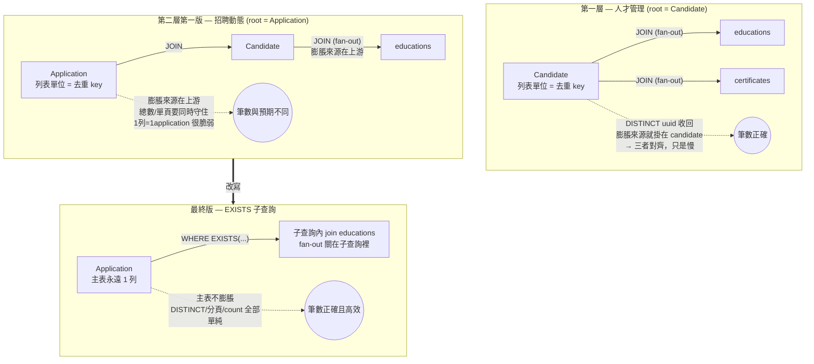

## 背景

系統中有兩個會對「候選人」做多條件篩選的列表頁，但它們查詢的**起點（root）不同**：

- **人才管理**（candidate-management）：列出候選人，root 就是 `Candidate`。篩學歷、工作經歷、證照等是 `candidate` 底下**第一層**的 collection。
- **招聘動態**（requisition-pipeline / inbox）：列出某職缺各階段的應徵/推薦紀錄，root 是 `Application` / `Recommendation` / `PersonnelInfo`。要篩候選人的學歷等，路徑變成 `application → candidate → educations`，是**第二層** collection。

兩頁共用同一份篩選條件（`CandidateRequest`）與共用框架的 `Predicate` DSL（以 `"educations.school"` 這類點分字串描述條件，由 `PredicateBuilder` 翻成 JPA Criteria）。直覺上「同一份條件、套到不同 root」應該能共用同一套查詢寫法——這個直覺正是後面踩坑的起點。

## 問題

招聘動態要支援「依學歷／工作經歷篩選」時，踩坑分三個階段：

1. **一開始根本不能查**：把人才管理用的 `"educations.school"` 條件套到 root = Application 的查詢，`PredicateBuilder` 解析到第二層 collection 時拋 `IllegalStateException`（`candidate.educations` 無法 `.get()`）。
2. **第一版能查、但筆數錯**：比照人才管理的做法，預先 `JOIN` 候選人的 collection 讓條件能解析。查得動了，卻因為笛卡兒積，**搜尋筆數與預期對不上**（總數與列出內容不一致）。
3. **追問：為什麼人才管理沒這問題？** 同樣是 join + DISTINCT，人才管理（第一層）只是慢、筆數對得上；招聘動態（第二層）卻會錯。這個「第一層只是慢、第二層卻錯」的差異，當時沒被正確理解，是這篇文章要釐清的核心。

## 原因分析

### 笛卡兒積的本質

對一對多關聯下 `LEFT JOIN`，主表的一列會被「乘」成 N 列（N = 對應子表的筆數）。多個 collection 同時 join 時，膨脹是**相乘**的：一個候選人有 3 段學歷、2 段工作經歷，同時 join 兩者就是 3 × 2 = 6 列。`@OneToMany`（如 `educations`）與 `@ElementCollection`（如 `certificates`）在這一點上**沒有差別**——兩者在資料庫都是獨立 table、靠外鍵關聯，都會 fan-out。

膨脹本身不是 bug，問題在於「列表查詢預期的單位是『一筆業務實體』，但 SQL 回來的是『膨脹後的列』」，於是需要靠 `DISTINCT` 把它收回去。而**能不能正確收回**，就是第一層與第二層的分水嶺。

### 關鍵：去重單位、列表單位、膨脹來源，三者是否對齊

這是昨天最容易誤解的地方。`DISTINCT` 不是萬靈丹——它能不能救回正確筆數，取決於**「去重的 key」是否等於「列表的單位」，以及「膨脹來源」是否就掛在那個單位上**。

**第一層（人才管理，root = Candidate）— 三者對齊**

```
列表單位：candidate
去重 key：candidate.uuid（DISTINCT / countDistinct 都用它）
膨脹來源：educations / certificates …（直接掛在 candidate 上）
```

舉例：候選人「王小明」有 3 段學歷。篩學校時 `JOIN educations`：

| 膨脹後的列 | uuid | name | school |
|---|---|---|---|
| row 1 | u-001 | 王小明 | 台大 |
| row 2 | u-001 | 王小明 | 政大 |
| row 3 | u-001 | 王小明 | 清大 |

`SELECT DISTINCT uuid, name, …` → 收回 **1 列**；`countDistinct(uuid)` → 數 **1 個**。膨脹來源掛在 candidate、去重 key 也是 candidate → **自我修正**。代價只有效能（DB 先產生 3 列再收回），筆數永遠對。

**第二層（招聘動態，root = Application）— 三者錯開一層**

```
列表單位：application（一個候選人可有「多筆」application，投不同職缺）
膨脹來源：candidate.educations …（隔著 candidate 關聯，掛在「上一層」）
去重 key：application（但膨脹根本不是 application 造成的）
```

舉例：王小明（3 段學歷）投了 4 個職缺 → 4 筆 application。篩學校時 `JOIN candidate JOIN candidate.educations`，每一筆 application 都被它「所屬候選人的學歷數」乘開：

```
application_A → 3 列（王小明的 3 段學歷）
application_B → 3 列
application_C → 3 列
application_D → 3 列
                ───────
單一候選人就貢獻 4 × 3 = 12 列
```

這裡有兩個第一層沒有的麻煩疊在一起：

1. **膨脹倍率更大且來源錯位**：膨脹不是 application 自己造成的，而是「上一層的 candidate」帶下來的；同一個候選人的多筆 application 各自再被乘一次。
2. **要同時讓「總數」與「單頁內容」都維持「1 列 = 1 application」變得脆弱**：見下一節。

一句話總結昨天的盲點：**第一層的「膨脹來源」和「去重/列表單位」是同一個實體，`DISTINCT` 與 `countDistinct` 都以 candidate 收斂，天生對齊；第二層的膨脹來源在列表單位的「上游」，要讓查詢回到「1 列 = 1 application」必須刻意維持，而第一版「比照人才管理」並沒有把這個不變式照顧好。**

### 分頁的隱含假設被打破

> **名詞**：**投影 (projection)** 即關聯代數的 π 運算——「挑欄位」，把每一列縮到由選定欄位組成的空間（`SELECT a, b` 就是投影到 `(a, b)`）。**純量 (scalar)** 指單一原子值（數字、字串、日期），對比於「一整個 entity 物件」。`SELECT DISTINCT uuid, name` 是**純量投影**（每列是一組純量值），`SELECT DISTINCT a` 是 **entity 投影**（每列是一個 Application 物件）。下面的「條件 2」會用到這個區分——關鍵在於投影是否只含列表單位自己的純量欄位。

分頁與計數都建立在一個沒寫出來的前提上：**「1 SQL 列 = 1 筆列表實體」**。笛卡兒積打破這個前提後，要讓查詢回到正確筆數，**需要兩個條件同時成立**：

1. **去重 / 計數的 key 是列表單位**（`DISTINCT` 與 `countDistinct` 都用列表實體的唯一鍵），且
2. **投影只含該列表單位自己的純量欄位**——膨脹出來的多列在被投影的欄位上完全相同，SQL `DISTINCT` 才能在 `LIMIT` **之前**就把它們壓回「1 列 = 1 實體」。

**第一層為何天生安全**：人才管理兩個條件都自然成立——它本來就只投影候選人自己的純量欄位（`SELECT DISTINCT uuid, name, photo, …`），去重也用 `uuid`。膨脹列在這些欄位上相同 → 收成「1 列 = 1 候選人」→ `LIMIT 20` 拿到 20 位候選人。代價只有效能（DB 仍先物化膨脹列）。

**第二層第一版為何出錯**：它「比照人才管理」加上 collection join，卻沒有同時守住這兩個條件，於是「總數」與「單頁內容」不再保證一致，使用者看到「搜尋筆數與預期不同」。

> 笛卡兒積外洩的**確切症狀**會隨 `DISTINCT` / `count` 怎麼寫而不同——可能是列表出現重複列、可能是總數膨脹、可能是 count 與內容對不上。本文不細究是哪一種；重點是 join 模式要「剛好同時守住兩個條件」才會對，這份脆弱本身才是問題，而第二層把它放大了。

### 總數與單頁是兩條獨立查詢

還有一層：列表的「總數 badge」與「當頁內容」是**兩條分開的查詢**（一條 `count`、一條取資料）。兩條都各自面對同一個笛卡兒積，只要它們的去重紀律沒對齊（例如一邊老實用 `countDistinct`、另一邊的投影/`DISTINCT` 卻沒守住「1 列 = 1 application」），使用者就會看到「上面說符合 N 筆、下面卻不是 N 筆」。第一層因為兩條查詢都自然以 candidate 收斂，才剛好一致；第二層要刻意讓兩條都對齊，難度高得多。

### 更早的故事：第二層「一開始根本不能查」

在筆數錯誤**之前**，招聘動態其實連查都查不動，根因在共用框架 `PredicateBuilder` 的路徑解析。它把 `"candidate.educations.school"` 這種點分路徑逐段拆解，每一段的策略是：

> **先在當前 `From` 既有的 join 裡找**（用 alias 或 attribute name 比對）→ 找到就重用那個 join；**找不到就 fallback 成 `path.get(segment)`**。

而對 **collection 屬性**呼叫 `.get()` 是非法的（collection 要用 `.join()`），會拋 `IllegalStateException`。於是：

- **第一層能查**，是因為人才管理的 `getTupleQueryBuilder` **預先 `join` 了**所有要篩的 collection（`educations`、`certificates`…）。PredicateBuilder 解析 `educations.school` 時，第一段 `educations` 找得到既有 join → 重用，不會 fallback。
- **第二層第一版能查**，靠的是「比照人才管理」——也在 `candidateJoin` 上預先 `join("educations")`。能查了，**但這正是把笛卡兒積引進來的那一步**。
- 若不預先 join，解析 `candidate.educations.school` 走到第二段 `educations` 找不到 join → fallback `candidateJoin.get("educations")` → 直接 `IllegalStateException`。

**關鍵不在「第幾層」本身，而在「那個 collection 屬性在解析前有沒有被 join 過」**——第一層碰巧被 `getTupleQueryBuilder` 預先 join 了所以沒事，第二層第一版沒先 join 才踩到。所以時間軸是：**不能查（path 解析失敗）→ 預先 join 讓它能查（引入笛卡兒積、筆數錯）→ 改 EXISTS（根除）**。前兩步都繞著「要不要、能不能預先 join」打轉，第三步才跳出這個框架。

### 全貌圖



## 解決方式

### 已實作：對 entity collection 改用 EXISTS 子查詢

核心想法是把「比對」從 `JOIN`（半連接會膨脹）換成 `EXISTS`（半連接但不膨脹）：子查詢以 collection 對應的 **entity** 當 root，透過 `candidate` 關聯與外層的 candidate correlate，外層只問「存不存在符合條件的子列」。

```java
// 子查詢 root = CandEducation（entity），fan-out 關在子查詢裡
Subquery<CandEducation> sub = query.subquery(CandEducation.class);
Root<CandEducation> edu = sub.from(CandEducation.class);
sub.where(cb.and(
    cb.equal(edu.get("candidate"), candidatePath),  // correlate 外層 candidate
    edu.get("school").in(schools)
));
return cb.exists(sub);
```

這一招同時解掉三件事：

1. **根除笛卡兒積**：`EXISTS` 只測「子查詢有沒有符合的列」，**不把子查詢的列 join/投影到外層**，所以子查詢內部的 fan-out 不會外洩——主表（Application / Candidate）永遠 1 列。`DISTINCT` 不必再為 collection 服務、分頁的「1 SQL 列 = 1 列表實體」前提回來了、總數與單頁不會再分岔——「原因分析」裡所有症狀的共同根源被移除。
2. **順帶解掉 path 解析失敗**：子查詢裡 `school` 是 `CandEducation` 的**第一段欄位**，不再是 `candidate.educations.school` 那種第二層 collection path，共用框架的 `PredicateBuilder` 不會走到非法的 `.get()`。
3. **一份程式碼吃兩條路徑**：`CandidateFilterExistsBuilder.apply(..., candidatePath, ...)` 用 `candidatePath` 參數抽象掉 root 差異——人才管理傳 `root`、招聘動態傳 `candidateJoin`，子查詢構造完全相同。

**為什麼是 EXISTS，而不是其他去重手段**：

| 手段 | 主表是否膨脹 | 分頁是否可靠 | 備註 |
|---|---|---|---|
| `JOIN` + **entity 投影** + `DISTINCT` | 會（先膨脹再收） | **脆弱** | 第二層第一版的寫法：未守住「只投影列表單位純量欄位」，總數與單頁易不一致 |
| `JOIN` + **純量投影** + `DISTINCT` | 會（先膨脹再收） | 可靠 | **治標**：投影須只含列表單位欄位、排除 collection 欄位，`ORDER BY` 也須在投影內；筆數對但笛卡兒積仍在、仍慢。即人才管理現況 |
| `EXISTS` 子查詢 | **不膨脹** | 可靠 | **治本**：半連接語意，天生「存在即可」，投影不受限 |
| 子查詢 `uuid IN (...)` | 不膨脹 | 可靠 | 兩段式、IN 清單可能很大、多條件要自己交集 |

「純量投影」與「EXISTS」都能讓筆數正確，差別在前者**沒有消除**笛卡兒積（DB 仍先物化膨脹列再去重），後者讓主表根本不膨脹。EXISTS 的成本是「每個 collection 條件一個 correlated 子查詢」，效能依賴 `candidate` 外鍵有 index（一般都有）。多條件就是多個 `AND EXISTS(...)`，各自獨立、語意清楚。

### 未收尾：embeddable collection 還沒搬

學歷、工作經歷能直接套上面這招，是因為 `CandEducation` / `CandWorkExperience` 是 `@Entity`——`subquery.from(X)` 只接受 managed entity type。但下列篩選欄位對應的是 `@ElementCollection` + `@Embeddable`：

```
CandCertificate        @Embeddable → cand_certificate
CandExpertise          @Embeddable → cand_expertise           (specialities + computerSkills)
CandForeignLanguage    @Embeddable → cand_foreign_language
CandProjectAchievement @Embeddable → cand_project_achievement
```

`@Embeddable` 沒有 entity 身分，`query.subquery(CandCertificate.class)` 這條路走不通，所以當初沒一起搬。它們現在仍停在 join 模式——在人才管理是「能查但會膨脹」，在招聘動態則是 latent bug（第二層 `candidate.certificates.title` 同樣會踩 `.get()` 例外，只是 UI 尚未開放這些篩選而未被觸發）。

**解法仍是 EXISTS，只是換 root**：embeddable 不能當 subquery root，但 **`Candidate` 可以**。把 join 收進子查詢內部，fan-out 一樣被 EXISTS 關住：

```java
// 子查詢 root = Candidate（entity），在子查詢內 join embeddable collection
Subquery<Integer> sub = query.subquery(Integer.class);
Join<?, Candidate> c = sub.correlate(candidatePath);   // correlate 外層 candidate
Join<Candidate, CandCertificate> cert = c.join("certificates");
sub.select(cb.literal(1)).where(cert.get("title").in(titles));
return cb.exists(sub);
```

候選的三條路與取捨：

| 方案 | 改 schema | 與現有架構一致 | blast radius |
|---|---|---|---|
| **A. Candidate-root EXISTS**（上面） | 不用 | ◎ 沿用 `CandidateFilterExistsBuilder` | 小（推薦） |
| B. 把 `@Embeddable` 升格成 `@Entity` | 要加 PK 欄位 | ○ 與 education 完全對稱 | 大（動 mapping / 序列化 / 匯入匯出） |
| C. 先查出符合的 `candidate.uuid` 再 `IN (...)` | 不用 | △ 另一套 | 中 |

方案 A 不動資料庫、最小新概念，且能一口氣修掉「人才管理的膨脹」與「招聘動態的 latent path 例外」兩條——是收尾這批 embeddable 的建議方向。

## 教訓

1. **`DISTINCT` 不是去重萬靈丹**。下任何 collection join 前，先檢查三件事是否對齊：**去重 key、列表單位、膨脹來源所在的實體**。三者同一個實體（第一層）才安全；錯開一層（第二層）就要小心。退一步，若一定要用 join，至少改成**純量投影**（只投影列表單位的欄位、排除 collection 欄位）讓筆數正確——但那只治標。

2. **collection 篩選預設用 `EXISTS`，不要用 `JOIN`**。尤其當查詢的 root 不是該 collection 的直接擁有者（第二層以上）時，join 幾乎一定要改 EXISTS——它讓主表不膨脹，一次解決分頁、count、path 解析三類問題。

3. **「同一份條件套到不同 root」是陷阱**。root 換了，同一個 collection 的「層數」就換了：能不能被 `PredicateBuilder` 解析、會不會膨脹、`DISTINCT` 救不救得回來，全都跟著變。共用篩選條件 ≠ 能共用查詢寫法。

4. **`@OneToMany` 與 `@ElementCollection` 在查詢膨脹上毫無差別**——都是獨立 table、都會 fan-out。它們的差別只在「能不能當 subquery root」（entity 可、embeddable 不可），這影響的是 EXISTS 的**寫法**（embeddable 改以 `Candidate` 當 root、在子查詢內 join），而不是「要不要處理」。別因為它是 embeddable 就以為沒有笛卡兒積問題。

## 相關
- [REQUIRES_NEW 交易傳播](Transaction-REQUIRES_NEW-Pattern.md) — 交易傳播相關
- [JVM heap OOM 診斷方法論](jvm-heap-oom-diagnosis.md) — 另一種 Hibernate 集合追蹤撐爆 heap 的診斷（histogram 判讀）
