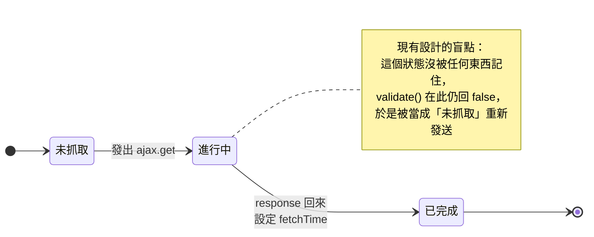
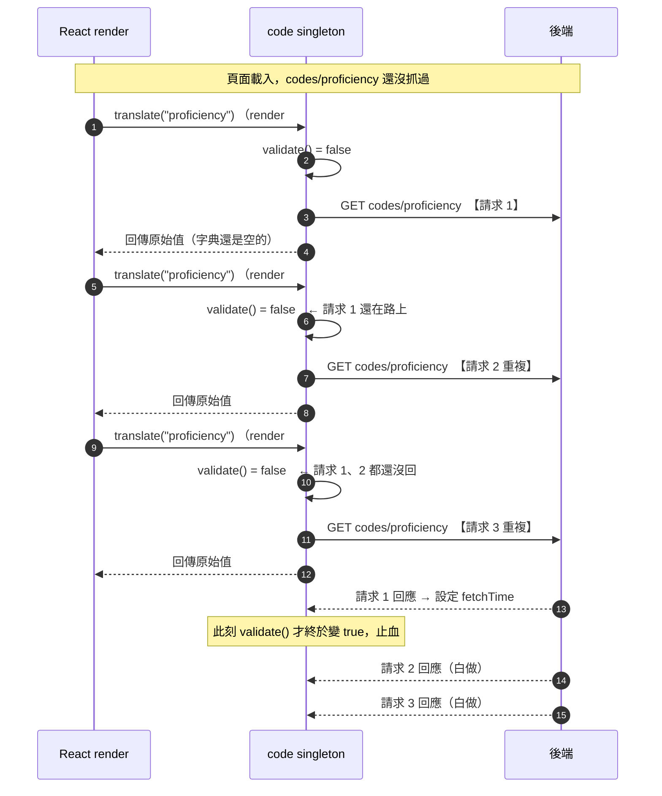
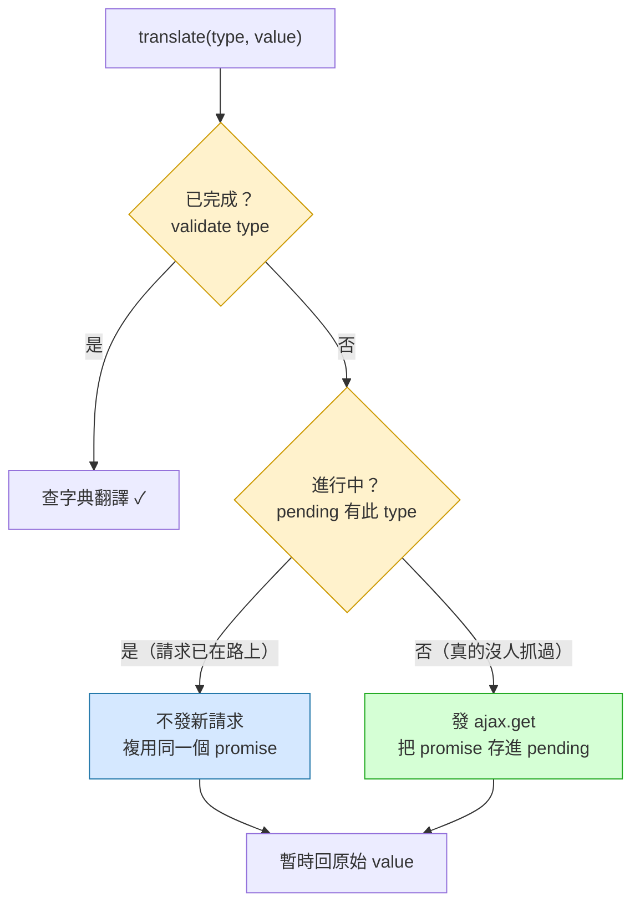

## 背景

portal 的職缺頁（`requisitions/[uuid]`）用兩個 singleton 快取代碼資料：

- `lib/shared-lib/core/code.js` 的 `code`：翻譯 enum 代碼（`salaryType`、`proficiency`、`degree`…），呼叫 `GET codes/{type}`
- `util/reference/index.js` 的 `reference`：翻譯參照資料（`major`、`certificate`…），呼叫 `setting/*`

兩者的 `translate(type, value)` 都是**同步函式，直接寫在 JSX 裡**，渲染時逐一呼叫。設計意圖是：第一次遇到某個 type 就背景發 API、把結果存進字典，之後同 type 直接命中快取、不再打 API。

測試職缺頁時發現：同一個 `codes/{type}` 在頁面載入瞬間被**重複發送數十次**。

---

## 問題

快取「看起來」有做——`code` 有 `#dictionaries`、`reference` 有 `data` Map，也有 `validate()` 判斷是否已快取。但它擋不住重複請求。

核心程式碼（`code.js`，`reference` 結構相同）：

```js
translate(type, value) {
    if (!this.validate(type)) {
        this.fetch(type).catch();   // 沒快取 → 背景發請求
    }
    // ...查字典，沒有就回原始 value
}

async fetch(type) {
    if (this.validate(type)) return this.get(type);
    const response = await ajax.get(`codes/${type}`);   // ← 沒有任何「進行中」的防護
    // ...寫入字典
    dictionary.fetchTime = time.now();                  // ← validate 要靠這個才會變 true
}

validate(type) {
    // 只有「fetchTime 存在且未過期」才回 true
}
```

問題出在 `validate()` 只認得「**已完成**」的快取——它檢查 `fetchTime`，而 `fetchTime` 只在 **response 回來之後**才被設定。在請求已發出、但結果還沒回來的這段空窗期，`validate()` 仍然回 `false`。

---

## 原因分析

### 關鍵：一個 type 其實有三種狀態，但程式碼只認得兩種

`validate()` 是一個 boolean，把世界切成「已快取 / 沒快取」兩塊。但實際上一筆資料的生命週期有**三個**狀態：



`validate()` 把「**進行中**」誤判成「**未抓取**」。對 `translate()` 來說，「請求已經在路上了」跟「從來沒人抓過」長得一模一樣——兩者 `validate()` 都回 `false`，於是都會再發一次。

### 重複是怎麼被放大的

`translate()` 寫在 render 裡，而 React 在頁面初載時會連續 re-render 多次（`setReady`、`setOrganization`、撈履歷、聲明檢查…各觸發一次）。每一次 re-render，只要某個 type 的請求還沒回來，就會再發一次。下面的時序圖看得最清楚：



再疊上「同一個 type 在一次 render 內被呼叫多次」（例如 `proficiency` 在每個外語的聽說讀寫各被叫 1 次，3 個外語就是 12 次），重複量輕鬆衝到數十。

### 為什麼快取「必須在 in-flight 時就存在」

這是整件事的核心觀念，用一句話講：

> **「是否已經有人在抓這筆資料」這個事實，在請求發出的那一瞬間就成立了，不是等結果回來才成立。**

快取的職責不只是「存**結果**」，更要「存**承諾（promise）**」——記住「這個 type 已經有一個請求在飛了，別再發」。現有設計只在終點線（response 回來、寫 `fetchTime`）插旗，於是從起跑到抵達的這整段時間，所有人都以為比賽還沒開始。

把判斷從「二元」升級成「三元」就解決了：



差別只在中間多了一個 `pending` 判斷：原本「否」這條路把「進行中」和「未抓取」混為一談，現在拆開——進行中就閉嘴複用，真沒抓過才發。一旦 `pending` 在**請求發出的同一時間**就被寫入，第 2、3 次 re-render 走到的就是藍色那條路，重複請求歸零。

---

## 解決方式

兩個層次，可擇一或並用。

### 1. 治本：在快取加 in-flight 去重（需動 core）

給 `code` / `reference` 各加一個 `#pending = new Map()`，存「type → 進行中的 promise」：

```
fetch(type):
  if validate(type)       → 回已完成的快取
  if #pending.has(type)   → 回同一個進行中的 promise   ← 關鍵新增
  否則建立 promise 存入 #pending，settle 後（finally）清掉
```

全站所有頁面一起受惠。代價：`code.js` 屬 shared-lib 核心（跨專案「必須同步」），改完要同步到 下游客製專案/下游客製專案。

### 2. 治標：頁面層 gate，等快取暖好才渲染（不動 core）

職缺頁其實已經有 `code.assert(...)` 在 `useEffect` 裡預載入、完成後 `setReady(true)`。但 `Box` 的 `ready` prop **只在內容上疊一層 spinner，沒有擋住 children 渲染**，所以 `translate()` 照樣在快取空窗期被呼叫。

把會用到 `translate` 的內容主體真正包進 `{ready && (...)}`，等 assert 完成、字典暖好（`validate` 全 true）才渲染，render 路徑就一個重複請求都不會發。只動一個檔案、不碰核心、不用跨專案同步。

> 註：`assert` 那條預載入路徑本身是循序 `await`，每個 type 只發一次、乾淨；真正的重複全來自 render 路徑搶在 assert 完成前呼叫 `translate`。所以「gate 住 render 路徑」就足以止血。

---

## 教訓

- **快取鍵的生命週期應該從「請求發起」算起，不是從「請求完成」算起。** 只記錄「已完成」的快取，會在 in-flight 空窗期把每一次呼叫都誤判成全新請求。
- **非同步資料的狀態是三態（未抓取 / 進行中 / 已完成），別用一個 boolean 硬塞成二態。** `validate()` 這種「有沒有結果」的判斷，天生看不見「正在抓」。
- **「在 render 裡同步觸發 side effect」會把這個缺陷放大數十倍**，因為 React 的多次 re-render 等同於對同一個空窗期反覆扣板機。要嘛讓快取自己去重（治本），要嘛別在資料就緒前渲染（治標）。
- 這個模式是通用的：任何「lazy load + 同步讀取」的快取（不限 React、不限這專案）只要少了 in-flight 去重，都會在高頻呼叫下發出重複請求。成熟的資料層（React Query、SWR、Apollo）內建的「request deduplication」解的正是這件事。

## 相關
